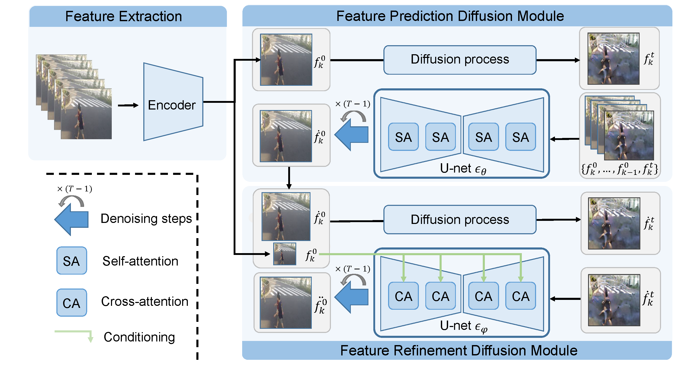

<div align="center">

<h1>Feature Prediction Diffusion Model for Video Anomaly Detection </h1>

Cheng Yan<sup>1</sup>, &nbsp; 
Shiyu Zhang<sup>1</sup>, &nbsp;
Yang Liu<sup>2</sup>, &nbsp;
Guansong Pang<sup>3*</sup>, &nbsp;
Wenjun Wang<sup>1</sup>

<sup>1</sup>Tianjin University, &nbsp;
<sup>2</sup>Zhejiang University, &nbsp;
<sup>3</sup>Singapore Management University

</div>

## 🚀 Overview
<div align="center">

</div>

## 📖 Description

Anomaly detection in the video is an important research area and a challenging task in real applications. Due to the unavailability of large-scale annotated anomaly events, most existing video anomaly detection (VAD) methods focus on learning the distribution of normal samples to detect the substantially deviated samples as anomalies. To well learn the distribution of normal motion and appearance, many auxiliary networks are employed to extract foreground object or action information. These high-level semantic features effectively filter the noise from the background to decrease its influence on detection models. However, the capability of these extra semantic models heavily affects the performance of the VAD methods. Motivated by the impressive generative and anti-noise capacity of diffusion model (DM), in this work, we introduce a novel DM-based method to predict the features of video frames for anomaly detection. We aim to learn the distribution of normal samples without any extra high-level semantic feature extraction models involved. To this end, we build two denoising diffusion implicit modules to predict and refine the features. The first module concentrates on feature motion learning, while the last focuses on feature appearance learning. To the best of our knowledge, it is the first DM-based method to predict frame features for VAD. The strong capacity of DMs also enables our method to more accurately predict the normal features than non-DM-based feature prediction-based VAD methods. Extensive experiments show that the proposed approach substantially outperforms state-of-the-art competing methods.

## 📖 PDF
https://github.com/daidaidouer/FPDM/edit/main/README.md

## 🗓️ TODO
- [ ] Release code


## 🎫 License

The content of this project itself is licensed under [LICENSE](LICENSE).

## 🖊️ Citation


If you find this project useful in your research, please consider cite:


```BibTeX
@article{yan2023feature,
  title={Feature Prediction Diffusion Model for Video Anomaly Detection},
  author={Yan, Cheng and Zhang, Shiyu and Liu, Yang and Pang, Guansong and Wang, Wenjun},
  booktitle={Proceedings of the IEEE/CVF International Conference on Computer Vision},,
  year={2023}
}
```
